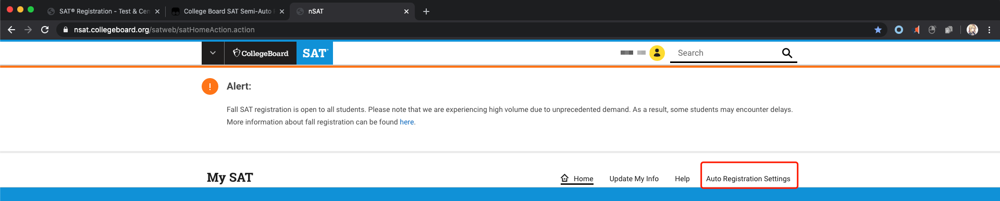
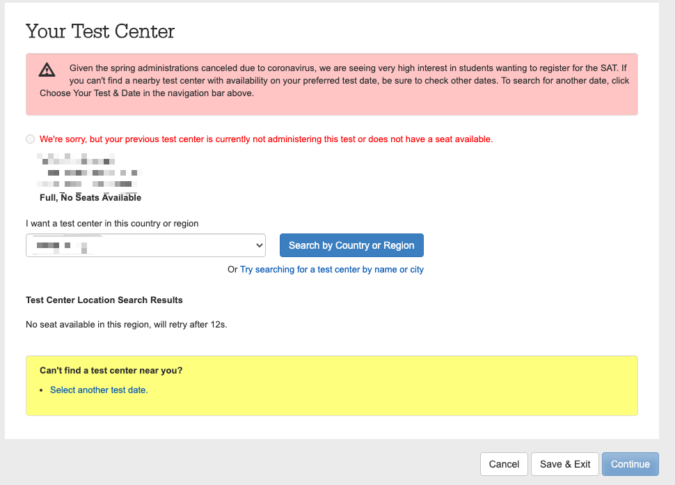
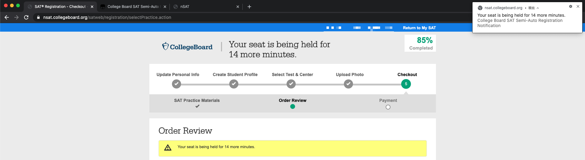

# College Board SAT Semi-Auto Registration

Your helper in College Board SAT registration

SAT is a registered trademark of the College Board, and this project is not affliated with either the College Board or SAT.

Features
---
- Continue to fill the personal information from the initial page
- Auto login to specified account
- Skip filling of personal information
- Accept the terms
- Check if any registration date is available
- Select a test center and go to the payment page
- Check if any seat is available in the region you selected
- Skip uploading of new photo
- Skip buying practice materials
- Notify you during the seat is being held
- Auto pay for the new test using a credit card
- Refresh when the website is down

Usage
---
1. Use [Tampermonkey](https://chrome.google.com/webstore/detail/tampermonkey/dhdgffkkebhmkfjojejmpbldmpobfkfo) on Chromium-based browsers (e.g. Chrome on PCs and Yandex Browser Beta on Android devices) to load the content in main.js;
2. Grant notification and sound permissions for https://nsat.collegeboard.org/, https://pps.collegeboard.org/, and https://account.collegeboard.org/ (or the plugin would get stuck);
3. Go to https://nsat.collegeboard.org/satweb/satHomeAction.action, sign in, and click *Auto Registration Settings*;
4. Answer the questions to enable the features you need.

Screenshots
---

